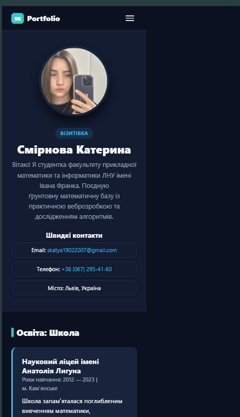
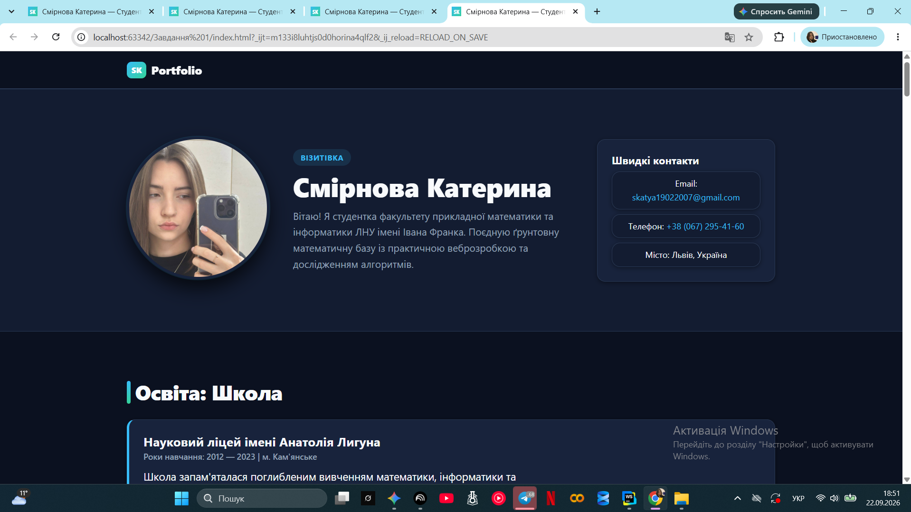
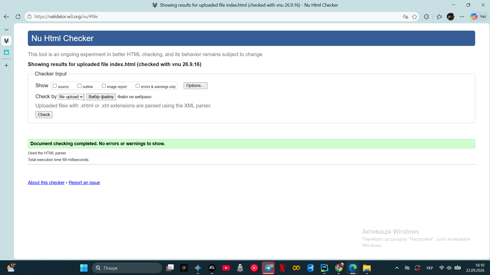
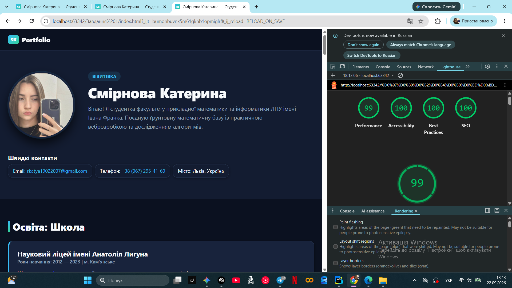

# Персональне студентське портфоліо (Mobile First)

Персональний статичний сайт-портфоліо студентки 3 курсу факультету прикладної математики та інформатики ЛНУ ім. Івана Франка Смірнової Катерини.

* **Жива сторінка (GitHub Pages):** [https://katyasmirnova.github.io/portfolio/](https://katyasmirnova.github.io/portfolio/)
* **Репозиторій проєкту:** [https://github.com/katyasmirnova/portfolio](https://github.com/katyasmirnova/portfolio)

---

## 1. Опис реалізованих брейкпойнтів та трьох макетів

Сайт розроблено суворо за методологією **Mobile First**: базові стилі розраховані на найвужчі екрани смартфонів (від 320px), а всі медіа-запити використовують виключно умову `@media (min-width: ...)` без жодного використання `max-width`.

| Елемент / Секція | Мобільний (< 768px) | Планшетний (768px – 1199px) | Десктопний (≥ 1200px) |
| :--- | :--- | :--- | :--- |
| **Навігація** | Приховане бургер-меню без JS на семантичному тегу `
/
`. | Горизонтальний flex-список посилань, згорнутий бургер ховається (`display: none`). | Горизонтальне меню поруч із логотипом в один ряд, закріплена шапка (`position: sticky`). |
| **Секція «Про мене»** | Одноколонковий вертикальний потік: фото по центру над текстом, контакти внизу. | Розкладка Flexbox: фото ліворуч, текстовий опис праворуч, контакти під ними. | CSS Grid (3 колонки): окремо фото, текстовий контент та бічна панель `<aside>` з контактами. |
| **Галерея подорожей** | 1 колонка: вертикальний список зображень. | CSS Grid: сітка карток на 2 колонки (`repeat(2, 1fr)`). | CSS Grid («Мозаїка»): 3 колонки з різними `grid-column: span 2` та абсолютними підписами. |
| **Сітки карток** | 1 колонка на всю ширину екрана. | 2 колонки (`repeat(auto-fit, minmax(280px, 1fr))`). | 3–4 колонки карток. |
| **Типографіка** | Базовий розмір 16px, адаптивні заголовки через `clamp()`. | Базовий розмір ~17px через формулу `clamp(1rem, 0.95rem + 0.25vw, 1.125rem)`. | Базовий розмір 18px, обмеження довжини рядка `max-width: 70ch`. |

---

## 2. Звіт про контрастність кольорів (WCAG AA ≥ 4.5:1)

Перевірку здійснено відповідно до стандарту WCAG AA за допомогою Chrome DevTools / WebAIM Contrast Checker:

1. **Основний текст та фон сторінки:**
    * Світла тема: текст `#0f172a` на фоні `#ffffff` — контраст **15.8:1** (Перевищує 4.5:1, Passed).
    * Темна тема: текст `#f8fafc` на фоні `#0b1120` — контраст **16.1:1** (Passed).
2. **Другорядний (приглушений) текст:**
    * Світла тема: колір `#475569` на фоні `#ffffff` — контраст **7.2:1** (Passed).
    * Темна тема: колір `#94a3b8` на фоні `#131c31` — контраст **6.5:1** (Passed).
3. **Акцентні посилання та кнопки:**
    * Кнопка: текст `#ffffff` на синьому фоні `#0284c7` — контраст **4.6:1** (Passed).
    * Посилання темної теми: колір `#38bdf8` на фоні `#0b1120` — контраст **9.3:1** (Passed).

---

## 3. Скриншоти макетів, валідатора та звіту Lighthouse

> *Усі скриншоти розміщені в папці `docs/screenshots/`.*

### Три різні макети (Responsive)
* **Мобільна версія (375px):**  
  
* **Планшетна версія (768px):**  
  
* **Десктопна версія (1200px+):**  
  

### W3C Markup Validation Service
Перевірка без помилок (Valid HTML5):  

### Звіт Google Lighthouse (Mobile)
Показники категорій **Accessibility** та **Best Practices** становлять ≥ 90 балів:  

---

## 4. Декларація використання генеративного ШІ

Відповідно до розділу 11 вимог завдання, наводиться детальний опис застосування ШІ-інструментів:

* **Використані інструменти:** Google Gemini.
* **Для яких частин роботи:**
    1. Допоміжне рев'ю вихідного коду `index.html` та `style.css` на предмет відповідності обов'язковим критеріям технічного завдання (виявлення заборонених інлайнових стилів `style="..."`, перевірка наявності обов'язкових семантичних тегів).
    2. Допомога у формуванні регулярного виразу (патерну) валідації полів форми замовлення та виправленні помилки W3C-валідатора щодо формату ширини тегу `<iframe>`.
    3. Консультація щодо налаштування мозаїчної сітки CSS Grid для десктопного макета секції галереї.
* **Залишені та власноруч адаптовані фрагменти:**
    * BEM-модифікатори для індикаторів прогресу в секції навичок (`.skill-card__fill--80` тощо);
    * Правило `width: 100%` у файлі CSS замість прямого атрибута ширини у відсотках у розмітці.